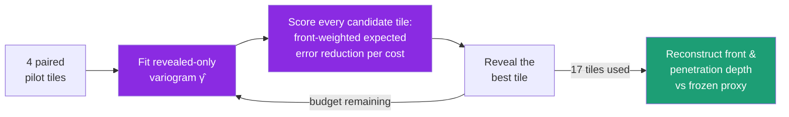

<div align="center">

# 🛰️ VEER

### Variogram Expected Error Reduction

**Scan a quarter of the sample. Reconstruct the corrosion front as if you scanned it all.**

VEER is a goal-oriented active-acquisition framework that decides *where to point an electron microscope next* so that a corrosion alteration-front is reconstructed accurately from a fraction of a full SEM-EDS map — using pure, interpretable geostatistical math.


</div>

---

## ✨ The headline

> On **235 held-out serial sections never used for any design decision**, VEER reconstructs the alteration-front proxy with **~14–17 % lower error than the strongest deterministic baseline — at identical scan cost**, with reconstruction quality also improved. The improvement carries a 95 % confidence interval that excludes zero on **both** pre-registered endpoints.

<div align="center">

| | Full raster | Baseline (`uncertainty_lookahead`) | **VEER** (`gated_veer_κ5`) |
|---|:---:|:---:|:---:|
| **Field scanned** | 100 % | ~26 % (≈4× less) | ~26 % (≈4× less) |
| **Composite error** | ~0 (defines truth) | 0.137 | **0.113** |
| **Relative improvement** | — | baseline | **−17.4 %** |
| **Reconstruction RMSE** | — | baseline | **−1.7 %** (better) |
| **Scan dose** | full | 1× | **1× (equal)** |

</div>

---

## 🎯 The idea in one picture

The evaluator reconstructs the hidden map by **nearest observation**, so the expected squared error at any pixel is approximately the **semivariogram** of the signal at the distance to its nearest sample. That single fact unifies "cover more ground" and "use the data you've seen" into one objective:

```text
utility(tile) = Σ_pixels  w_pixel · [ γ̂(dist_now) − γ̂(dist_after_tile) ] / cost(tile)
                └──────────────┘   └──────────────────────────────────┘
                 front-weighted        expected error reduction under a
                 (where it matters)    revealed-only learned variogram γ̂
```

- The classic coverage baseline is just the special case **γ̂(d) = d** with uniform weights — so VEER *contains* the baseline, and the data decides how far to depart from it.
- No exchange-rate hyperparameter, no learned/black-box model — every tile choice traces to closed-form geostatistics.



Dense elemental maps are **hidden** from the policy and used only to reveal queried tiles and to score the final reconstruction — a faithful stand-in for a real microscope that cannot see what it has not scanned.

---

## 📊 Results

### Held-out confirmation — 235 slices, never touched during development

<div align="center">

| Endpoint | Mean Δ vs baseline | 95 % CI | Relative | Equal cost |
|---|:---:|:---:|:---:|:---:|
| Final-iteration (legacy) | **−0.0239** | [−0.0377, −0.0102] | **−17.4 %** | ✅ |
| Trailing-median (pre-registered co-primary) | **−0.0189** | [−0.0355, −0.0023] | **−13.6 %** | ✅ |

</div>

### ⚠️ Honest characterization: a *mean* win, not a per-slice guarantee

VEER is a **risk redistribution**, and this README says so up front:

- Big wins outnumber big losses roughly **2 : 1** (53 vs 22 large effects), and the gains concentrate on the *hard* slices where coverage alone struggles.
- The median slice is near a wash, and ~25 % of slices regress — the per-slice distribution is heavy-tailed.
- A perfect per-slice router between the two policies could reach ~0.086, but **we showed that routing is not achievable** from any observable signal (a documented negative result, not a hidden limitation).

> The defensible claim is *"~14–17 % lower expected error at equal dose, with per-slice variance"* — never per-slice dominance.

---

## 🧪 Built like an experiment, not a demo

The methodology is the point as much as the method:

- **Pre-registered endpoints & exclusions** — the robust trailing-median co-primary and the degenerate-slice rule were fixed (with dated rationale) *before* the confirmation run.
- **Frozen blocked folds & gates** — a 30-slice screening gate with seven criteria, then a one-shot confirmation on the **untouched** remainder of the stack.
- **Paired comparisons** — every policy sees identical pilot tiles per slice and the identical nearest-observation evaluator, isolating the acquisition effect.
- **Reproducible & honest** — deterministic seeds, resumable checkpoints, parallel workers proven bit-identical to serial, and reported negative results.

<details>
<summary><b>📋 The seven gate criteria</b></summary>

```text
mean composite-error delta              < 0   (95% CI excluding zero for full-stack promotion)
median composite-error delta           <= 0
leave-one-slice-out worst mean delta   <= 0
at least 3 of 5 blocked fold means     <= 0
RMSE regression                        <= 2%
scan cost                               = equal
maximum single-slice regression        <= 0.02
```
On the 30-slice screening cohort, `gated_veer_4x4_mean_kappa5` passed **all seven**.
</details>

---

## ⚡ Quickstart

```powershell
# install
python -m venv .venv
.\.venv\Scripts\python.exe -m pip install -e ".[test]"

# test
.\.venv\Scripts\python.exe -m pytest tests -q
```

```powershell
# run the confirmed policy vs the baseline across the whole stack, in parallel
.\.venv\Scripts\python.exe -m veer validate-veer-stack `
  --config configs\alloy617_veer.yaml `
  --manifest data\alloy617_nrds\full_stack_download_manifest.csv `
  --fold all `
  --policies uncertainty_lookahead,gated_veer_4x4_mean_kappa5 `
  --workers 12 `
  --out results\veer
```

Add `--slices 001,011,021,...` for a quick smoke. Runs are **resumable** (re-run to continue from the last checkpoint), and `--workers N` is **bit-identical** to serial.

---

## 🧬 The policy family

`uncertainty_lookahead` is the deterministic coverage baseline; everything else is VEER, increasingly refined.

<details>
<summary><b>Show all policies</b></summary>

```text
uncertainty_lookahead                    # coverage baseline  (γ = d)
variogram_eer_4x4_mean_kappa{0,2,5}      # ML-fit variogram + front-band weighting
nested_veer_4x4_mean_kappa{0,2,5,10}     # nested no-sill WLS variogram (matches the real maps)
nested_band_veer_4x4_mean_kappa{2,5}     # nested variogram + Gaussian-band weights
gated_veer_4x4_mean_kappa{5,10}          # + movement-gated front weighting   (confirmed: kappa5)
```

The evolution was diagnostics-driven: the maps turned out to have **no variogram sill** (intrinsic, Brownian-like growth), which motivated the nested model; and a front-lock-in failure on "easy" slices motivated the **movement gate** that switches front-weighting off when the predicted front stops moving. Full narrative in [`docs/DESIGN.md`](docs/DESIGN.md).
</details>

---

## 📁 Layout

```text
src/veer/
├── domain.py        # pydantic config (RunConfig · AcquisitionConfig · VariogramConfig)
├── data.py          # dataset ingestion (binary element maps → zarr)
├── morphology.py    # frozen unsupervised front/penetration proxy + nearest-obs evaluator
├── features.py      # subtile features + anisotropic Matérn-3/2 kernel
├── replay.py        # ROI catalog · raster cost · folds · scoring · checkpoints
├── variogram.py     # calibrated model-averaged + nested-WLS variogram estimation
├── selection.py     # VEER candidate scoring + front weighting
├── validation.py    # resumable, parallel stack validation + endpoints
└── cli.py           # `veer validate-veer-stack`
configs/alloy617_veer.yaml     tests/test_veer.py     docs/DESIGN.md
```

---

## 🔬 What's under the hood

The acquisition policy is **fully interpretable** — model-averaged Matérn-3/2 variograms, kriging-style expected-error reduction, and non-negative least squares. **No neural networks and no trained/supervised models.** The only classical learning components are *unsupervised* and live in the evaluator, not the decision loop: PCA for subtile-feature embedding, and a Gaussian-mixture clustering that defines the frozen front proxy every policy is scored against.

---

## 💾 Data & credit

This work is built entirely on a public dataset produced by other researchers. All credit for the underlying measurements goes to its authors:

> **Trishelle M. Copeland-Johnson, Daniel J. Murray, Guoping Cao, and Lingfeng He** — *Focused Ion Beam Tomography of Alloy 617 Corroded in Molten Chloride Salt*, Idaho National Laboratory / NSUF Nuclear Reactor Data System (NRDS). DOI: [10.48806/2287679](https://doi.org/10.48806/2287679). Licensed **CC BY 4.0**.
>
> Companion publication: Copeland-Johnson, Murray, Cao & He, *Assessing the interfacial corrosion mechanism of Inconel 617 in chloride molten salt corrosion using multi-modal advanced characterization techniques*, **Frontiers in Nuclear Engineering** (2022), DOI: [10.3389/fnuen.2022.1049693](https://doi.org/10.3389/fnuen.2022.1049693).

The stack is Alloy 617 / Inconel 617 corroded in NaCl–MgCl₂ molten salt at 700 °C for 1000 h (FIB tomography; 265 sections; 15 elemental channels). Bulk binary maps are not version-controlled — only manifests, provenance, and the downloader (`scripts/`) are. See [`data/alloy617_nrds/README.md`](data/alloy617_nrds/README.md). If you use this repository, please cite the dataset DOI and the companion publication above.

## 📜 License

The VEER source code is released under **Creative Commons Attribution 4.0 International (CC BY 4.0)** — you are free to use, modify, and redistribute it, including commercially, with attribution. See [`LICENSE`](LICENSE). The bundled dataset is separately licensed CC BY 4.0 by its authors (above).

---

## ⚠️ Scientific caveats

- The alteration front is a **frozen unsupervised proxy**, not expert-labeled truth.
- Results are **retrospective replay** on dense maps, not live microscope control.
- All comparisons share the same nearest-observation evaluator to isolate the acquisition-policy effect.
- Evidence is from **one specimen** (265 spatially correlated serial sections); broad generalization requires additional specimens.

---

<div align="center">

*Variogram Expected Error Reduction · interpretable adaptive acquisition for corrosion microscopy*

See [`docs/DESIGN.md`](docs/DESIGN.md) for the full method, derivations, gate definitions, and complete result tables.

</div>
